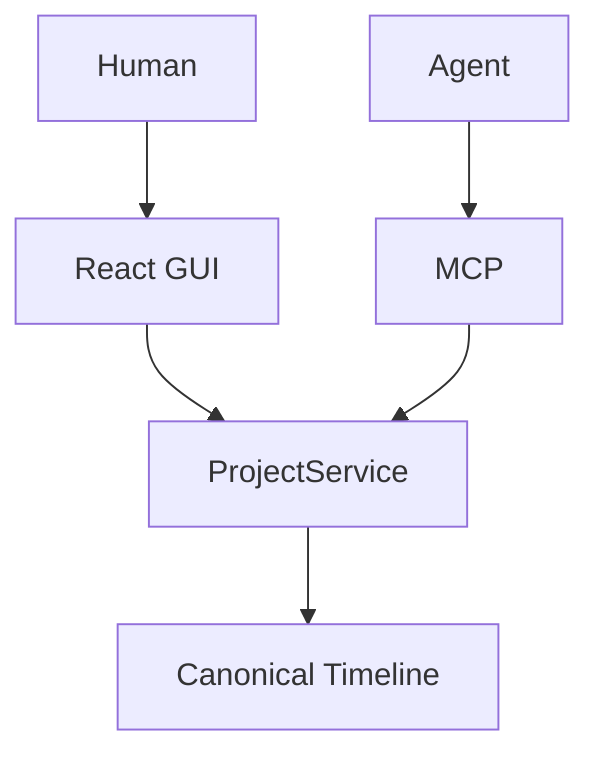

# TextSequence

TextSequence is a lightweight, open-source, MCP-native NLE where humans and AI
agents edit the same timeline.

It is an experimental agent-native editing architecture—not a Final Cut
replacement. The editor keeps media local, stores one canonical integer-frame
timeline, and gives external clients a deterministic MCP tool surface.

## Why TextSequence

Modern professional editors can be inaccessible on older or lower-spec
hardware. TextSequence explores a smaller architecture built from:

- a lightweight visual editor;
- deterministic local FFmpeg rendering;
- canonical project state with revision-safe mutations; and
- an MCP surface for agents to inspect and edit the same timeline.

## Demo

Suggested recording assets:

- Screenshot: capture the dark editor with the V1 timeline, rendered preview
  badge, and Agent Connections panel visible.
- Demo video/GIF: follow the exact 60–90 second script in
  [docs/demo-script.md](docs/demo-script.md).
- Before/after silence removal: use the reproducible workflow in
  [docs/demo-workflow.md](docs/demo-workflow.md).

## Features

Implemented in v0.2.2:

- local MP4 import and media streaming;
- canonical integer-frame V1 timeline with stable IDs;
- clip selection, split, trim, move, and delete;
- Render Preview and MP4 export through local FFmpeg;
- real Streamable HTTP MCP server with 15 tools, including timeline querying and marker mutations;
- eight read-only MCP Resources plus safe REST timeline/query/revision reads;
- canonical point and range timeline markers with deterministic ordering;
- revision-safe human and external-agent co-editing;
- schema-v2 canonical projects with explicit Timeline identity;
- immutable full-snapshot revision history with safe v1 promotion; and
- deterministic local silence analysis and removal;
- optional built-in OpenAI assistant; and
- no `OPENAI_API_KEY` requirement for core editing, rendering, or MCP use.

## MCP-native architecture



Both paths use the same service and the same persisted project JSON. Agents
decide what to request; TextSequence deterministically validates and executes
the operation.

## Silence removal

`analyze_silence` runs local FFmpeg `silencedetect` analysis and returns integer
frame ranges without changing the project. `remove_silence` re-checks the
current revision, maps source ranges onto the current timeline, compacts the
affected content, and saves one authoritative batch mutation. Analyze first,
then mutate second. Timestamps are never invented by an agent.

Defaults are a 700ms minimum silence, a -35dB threshold, and zero padding.

## Quickstart

Requirements:

- Python 3.12 (the project-local environment supports Python 3.10+);
- Node 18 with the pinned Vite 6 toolchain;
- FFmpeg on `PATH` for rendering and silence analysis; and
- ffprobe on `PATH`, or a compatible executable at `.tools/ffprobe/ffprobe`.

From a clean checkout:

```sh
make setup
make test
make backend
```

In another terminal:

```sh
make frontend
```

Open `http://127.0.0.1:5173`. The backend API is at
`http://127.0.0.1:8000`. Projects and runtime renders remain local and are
ignored by Git. Imported media is external and is never modified. Browser-
selected uploads are copied into the ignored local `media/{project_id}`
directory before probing and import. The original filename is retained as
asset display metadata, while the stored filename is sanitized and unique.
Path-based import remains available as an advanced option for deliberate
external references.

The deliberate Node choice is Node 18 + Vite 6: this pinned configuration is
stable and the production build passes; upgrading Node is not needed for this
release. The backend remains compatible with the existing Node 18 frontend
toolchain; no Node upgrade is required for v0.2.2.

## Canonical project and revisions

Persisted v2 JSON has one top-level `timeline` object; timeline tracks are
never persisted as a competing top-level collection. Project, timeline, asset,
track, and clip IDs are opaque and stable. Positions and revisions are integer
frames/numbers; rational frame rates retain their numerator and denominator.

Each new project is stored as a directory with `head.json` and immutable full
snapshots under `revisions/{revision_id}.json`. A loaded v1 flat file is
migrated in memory. The first successful mutation writes a deterministic
migration baseline plus `legacy-v1.json`, then commits the mutation; failed
mutations do not promote the file. The original flat file remains recoverable.

## MCP quickstart

The Streamable HTTP endpoint is:

```text
http://127.0.0.1:8000/mcp
```

Connect any compatible local MCP client. The verified Codex CLI registration
capability is:

```sh
codex mcp add textsequence --url http://127.0.0.1:8000/mcp
```

This command changes Codex configuration and is not run by TextSequence setup.
The installed CLI supports this URL registration syntax; model-driven Codex
read/write execution is not claimed as verified unless separately tested.

Follow `INSPECT → RESOLVE → MUTATE`: discover the project, inspect the current
revision and stable IDs, mutate with `expected_revision`, then inspect again.

## Available MCP tools

The server exposes exactly 15 tools:

1. `list_projects`
2. `get_timeline`
3. `get_editor_context`
4. `analyze_silence`
5. `remove_silence`
6. `split_clip`
7. `delete_clip`
8. `move_clip`
9. `trim_clip`
10. `render_preview`
11. `export_project`
12. `add_marker`
13. `update_marker`
14. `delete_marker`
15. `query_timeline`

The server also exposes eight read-only JSON Resources: the project collection,
current project, current timeline, asset, clip, marker, revision collection,
and reachable revision projections. Resource reads expose safe projections and
never expose source paths or raw revision snapshots.

See [docs/mcp-clients.md](docs/mcp-clients.md) for parameters and response
contracts.

## Example MCP workflow

```text
list_projects
get_timeline(project_id)
analyze_silence(project_id, minimum_silence_ms=700, noise_threshold_db=-35)
remove_silence(project_id, expected_revision=current_revision)
render_preview(project_id, expected_revision=new_revision)
```

Timeline markers are canonical absolute-frame metadata under
`project.timeline.markers`. Point markers use `end_frame: null`; range markers
use the exclusive interval `[start_frame, end_frame)`. Marker edits are
revision-checked and do not follow, rebase, or delete with clips. The timeline
projection reports `content_end_frame` separately from `display_end_frame`, so
markers beyond media remain visible without extending playback or render
duration.

## Optional built-in assistant

Copy `.env.example` to `.env` and set `OPENAI_API_KEY` only if you want the
optional built-in assistant. Manual editing, local rendering, REST, and
external MCP clients continue to work without it. The unauthenticated REST and
MCP endpoints are intended for localhost development/MVP use only.

## Limitations

- single source asset and V1-only timeline;
- CFR media constraint;
- no real-time composited timeline playback;
- synchronous rendering;
- no transcription or semantic video understanding;
- no best-take selection;
- no transitions or effects; and
- unauthenticated localhost-only MCP endpoint.

## Roadmap

Possible future directions include transcript-aware editing, multi-track
timelines, local-model agent integrations, richer MCP editing primitives,
B-roll workflows, and proxy support. No dates are promised.

## Project documentation

- [Architecture](docs/architecture.md)
- [MCP client guide](docs/mcp-clients.md)
- [Demo script](docs/demo-script.md)
- [Reproducible demo workflow](docs/demo-workflow.md)
- [Build Week submission copy](docs/build-week-submission.md)
- [Contributing](CONTRIBUTING.md)
- [Security](SECURITY.md)

## License

TextSequence is released under the [MIT License](LICENSE).
