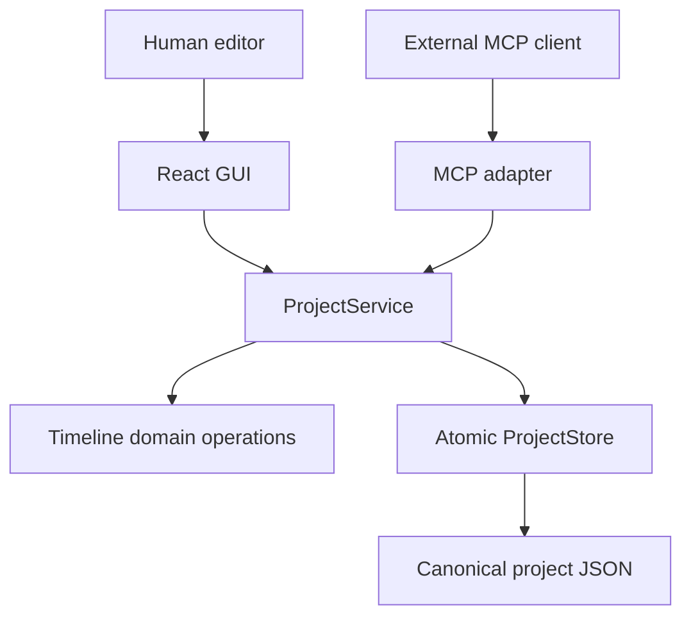
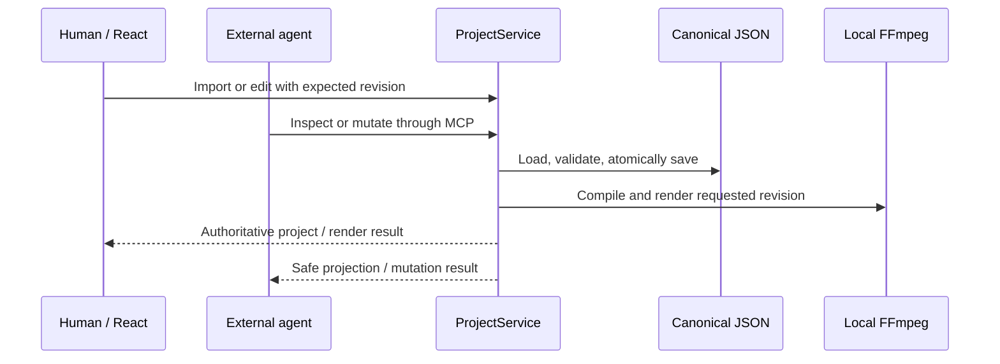

# TextSequence Architecture

TextSequence is a local-first editor whose persisted project JSON is the
canonical source of truth. Timeline positions are integer frames at a rational
frame rate; source-out positions are exclusive.

## Boundaries

- **Canonical Project State:** `Project`, `Asset`, `Track`, and `Clip` models
  are serialized to validated JSON with stable opaque IDs.
- **Timeline Domain Operations:** framework-independent split, delete, move,
  trim, and silence-removal operations validate frame bounds and collisions.
- **ProjectService:** loads authoritative state, serializes per-project
  mutations, checks expected revisions, and saves one authoritative result.
- **REST Adapter:** provides browser-facing project, media, editing, render,
  and silence endpoints without duplicating domain rules.
- **MCP Adapter:** exposes the same service through Streamable HTTP. It returns
  safe projections and never exposes source paths through timeline inspection.
- **FFmpeg Render Plan:** compiles canonical clips and gaps into a deterministic
  local FFmpeg command for preview or export.
- **Silence Analyzer:** runs local `ffprobe`/FFmpeg `silencedetect`, converts
  timestamps to integer frames, and separates read-only analysis from the
  revision-checked batch mutation.
- **React Polling:** polls the open project revision and adopts external MCP
  edits unless a local trim or move gesture is active.
- **Optional Built-in Agent:** uses the OpenAI Agents SDK as one optional MCP
  client; it is not required for core functionality.

The key design rule is convergence: GUI and MCP calls share the same service,
domain operations, revision checks, and persisted source of truth.
